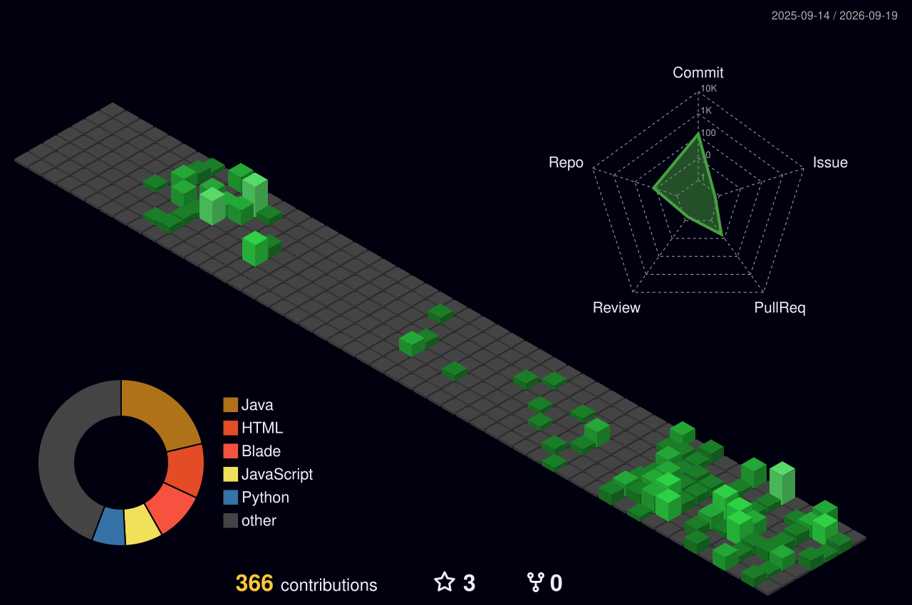

<!-- ═══════════════════════════════════════════════════════════ -->
<!-- 🎨 HEADER                                                 -->
<!-- ═══════════════════════════════════════════════════════════ -->

<p align="center">
  
</p>

<p align="center">
  <a href="https://github.com/onlydayone">
    
  </a>
  &nbsp;
  <a href="https://github.com/onlydayone?tab=followers">
    
  </a>
  &nbsp;
  <a href="https://github.com/onlydayone?tab=repositories">
    
  </a>
</p>

<p align="center">
  
  
  
</p>

<!-- ═══════════════════════════════════════════════════════════ -->
<!-- 👤 ABOUT ME                                               -->
<!-- ═══════════════════════════════════════════════════════════ -->

---

<h2> 👨‍💻 Tentang Saya</h2>

<div align="center">
<table>
<tr>
<td width="50%">

```js
const fito = {
    name: "Fito Rifqi Dwi Fatoni",
    alias: "onlydayone",
    role: "Mobile & Web Developer",
    location: "Indonesia 🇮🇩",
    focus: ["SkillBantuin", "JavaLan"],
    learning: ["Flutter", "Dart",
               "IoT", "Odoo ERP"],
    interests: ["Web Dev", "Mobile",
                "Backend", "UI/UX"],
    motto: "Build, learn, repeat 🚀"
};
```

</td>
<td align="center" width="50%">


</td>
</tr>
</table>
</div>

<!-- ═══════════════════════════════════════════════════════════ -->
<!-- 🛠️ TECH STACK                                             -->
<!-- ═══════════════════════════════════════════════════════════ -->

---

<h2> 🛠️ Tech Stack</h2>

<p align="center">
  
</p>
<p align="center"><sub>Languages & Frameworks</sub></p>

<p align="center">
  
</p>
<p align="center"><sub>Databases & Tools</sub></p>

<!-- ═══════════════════════════════════════════════════════════ -->
<!-- 🚧 PROJECTS                                               -->
<!-- ═══════════════════════════════════════════════════════════ -->

---

<h2> 🚀 Yang Sedang Saya Kembangkan</h2>

<div align="center">
<table>
<tr>
<td align="center" width="50%">
<h3>📱 SkillBantuin</h3>
<p>Aplikasi <em>micro-volunteering</em> berbasis skill</p>


</td>
<td align="center" width="50%">
<h3>🎵 Music IoT Visualizer</h3>
<p>Dashboard Arduino & Apple Music visualizer</p>


</td>
</tr>
<tr>
<td align="center" width="50%">
<h3>📊 Odoo Tracking</h3>
<p>Modul tracking & manajemen ERP</p>


</td>
<td align="center" width="50%">
<h3>💬 JavaLan Messenger</h3>
<p>Messenger app untuk logika pemrograman</p>

</td>
</tr>
</table>
</div>

<!-- ═══════════════════════════════════════════════════════════ -->
<!-- 📊 GITHUB STATS                                           -->
<!-- ═══════════════════════════════════════════════════════════ -->

---

<h2> 📈 Statistik GitHub</h2>

<p align="center">
  
</p>

<p align="center">
  
</p>

<!-- ═══════════════════════════════════════════════════════════ -->
<!-- 🧊 3D CONTRIBUTION GRAPH                                  -->
<!-- ═══════════════════════════════════════════════════════════ -->

<p align="center">
  
</p>

<!-- ═══════════════════════════════════════════════════════════ -->
<!-- 📫 CONTACT                                                -->
<!-- ═══════════════════════════════════════════════════════════ -->

---

<h2> 📫 Hubungi Saya</h2>

<div align="center">
<table>
<tr>
<td align="center" width="33%">
<a href="https://www.linkedin.com/in/fito-rifqi-a904a933b/" target="_blank">

</a>
<br/><br/>
<sub>Fito Rifqi</sub>
</td>
<td align="center" width="33%">
<a href="mailto:fitordf@gmail.com">

</a>
<br/><br/>
<sub>fitordf@gmail.com</sub>
</td>
<td align="center" width="33%">
<a href="https://github.com/onlydayone" target="_blank">

</a>
<br/><br/>
<sub>@onlydayone</sub>
</td>
</tr>
</table>
</div>

<!-- ═══════════════════════════════════════════════════════════ -->
<!-- 🔚 FOOTER                                                 -->
<!-- ═══════════════════════════════════════════════════════════ -->

<br/>

<p align="center">
  
</p>
