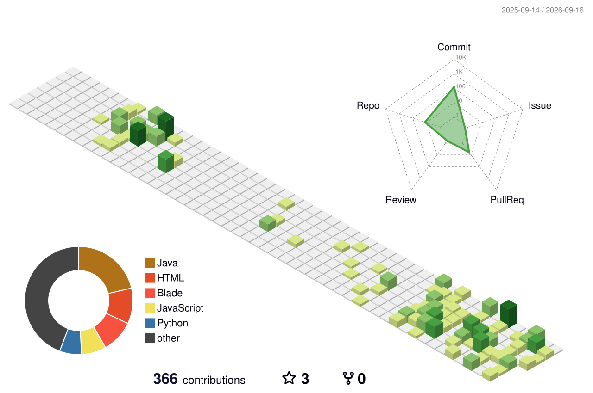

<p align="center">
  
</p>

<br/>

<div align="center">

  [](https://git.io/typing-svg)

</div>

<br/>

<p align="center">
  <a href="https://github.com/onlydayone">
    
  </a>
  &nbsp;
  <a href="https://github.com/onlydayone?tab=followers">
    
  </a>
  &nbsp;
  <a href="https://github.com/onlydayone?tab=repositories">
    
  </a>
</p>

<br/>

<!-- ═══════════════════════════════════════════════════════════ -->
<!-- 🔥 CURRENT FOCUS                                          -->
<!-- ═══════════════════════════════════════════════════════════ -->

<div align="center">

  
  
  

</div>

<br/>

<!-- ═══════════════════════════════════════════════════════════ -->
<!-- 👤 ABOUT ME                                               -->
<!-- ═══════════════════════════════════════════════════════════ -->


##  &nbsp;Tentang Saya

<br/>

<table>
<tr>
<td width="55%">

```js
const fito = {
    name: "Fito Rifqi Dwi Fatoni",
    alias: "onlydayone",
    role: "Mobile & Web Developer",
    location: "Indonesia 🇮🇩",
    
    currentFocus: [
        "SkillBantuin App",
        "JavaLan Messenger"
    ],
    
    learning: [
        "Flutter", "Dart",
        "IoT (Arduino)", "Odoo ERP"
    ],
    
    interests: [
        "Web Development",
        "Mobile Apps",
        "Backend Systems",
        "Beautiful UI/UX"
    ],
    
    motto: "Belajar sambil bikin project 🚀"
};
```

</td>
<td width="45%" align="center">


<br/><br/>

<a href="mailto:fitordf@gmail.com">
  
</a>

<br/>

<a href="https://www.linkedin.com/in/fito-rifqi-a904a933b/">
  
</a>

</td>
</tr>
</table>

<br/>

<!-- ═══════════════════════════════════════════════════════════ -->
<!-- 🛠️ TECH STACK                                             -->
<!-- ═══════════════════════════════════════════════════════════ -->


##  &nbsp;Tech Stack

<br/>

<div align="center">

### 📱 Languages


### 🚀 Frameworks & Tools


### 🗄️ Databases


</div>

<br/>

<!-- ═══════════════════════════════════════════════════════════ -->
<!-- 🚧 PROJECTS                                               -->
<!-- ═══════════════════════════════════════════════════════════ -->


##  &nbsp;Yang Sedang Saya Kembangkan

<br/>

<div align="center">

<table>
<tr>
<td align="center" width="50%">

### 📱 SkillBantuin
<br/>


Aplikasi *micro-volunteering* berbasis skill dengan fitur chat, pembayaran, dan rating

</td>
<td align="center" width="50%">

### 🎵 Music IoT Visualizer
<br/>


Dashboard Arduino & web terhubung ke Apple Music dengan audio visualizer

</td>
</tr>
<tr>
<td align="center" width="50%">

### 📊 Odoo Tracking
<br/>


Eksplorasi modul tracking & manajemen sistem enterprise (ERP)

</td>
<td align="center" width="50%">

### 💬 JavaLan Messenger
<br/>


Aplikasi messenger untuk melatih logika pemrograman fundamental

</td>
</tr>
</table>

</div>

<br/>

<!-- ═══════════════════════════════════════════════════════════ -->
<!-- 📊 GITHUB STATS                                           -->
<!-- ═══════════════════════════════════════════════════════════ -->


##  &nbsp;Statistik GitHub

<br/>

<div align="center">

<a href="https://github.com/onlydayone">
  
</a>
&nbsp;&nbsp;
<a href="https://github.com/onlydayone">
  
</a>

</div>

<br/>

<p align="center">
  
</p>

<br/>

<!-- Activity Graph -->
<p align="center">
  <a href="https://github.com/onlydayone">
    
  </a>
</p>

<br/>

<!-- ═══════════════════════════════════════════════════════════ -->
<!-- 🐍 SNAKE & 3D CONTRIBUTION                                -->
<!-- ═══════════════════════════════════════════════════════════ -->


## 🧊 3D Contribution Graph

<br/>

<p align="center">
  
</p>

<br/>

<!-- ═══════════════════════════════════════════════════════════ -->

## 🐍 Contribution Snake

<br/>

<p align="center">
  <picture>
    <source media="(prefers-color-scheme: dark)" srcset="https://raw.githubusercontent.com/onlydayone/onlydayone/output/github-snake-dark.svg" />
    <source media="(prefers-color-scheme: light)" srcset="https://raw.githubusercontent.com/onlydayone/onlydayone/output/github-snake.svg" />
    
  </picture>
</p>

<br/>

<!-- ═══════════════════════════════════════════════════════════ -->
<!-- 📫 CONTACT                                                -->
<!-- ═══════════════════════════════════════════════════════════ -->


##  &nbsp;Hubungi Saya

<br/>

<div align="center">

<a href="https://www.linkedin.com/in/fito-rifqi-a904a933b/" target="_blank">
  
</a>
&nbsp;&nbsp;
<a href="mailto:fitordf@gmail.com">
  
</a>
&nbsp;&nbsp;
<a href="https://github.com/onlydayone" target="_blank">
  
</a>

</div>

<br/><br/>

<!-- ═══════════════════════════════════════════════════════════ -->
<!-- 🔚 FOOTER                                                 -->
<!-- ═══════════════════════════════════════════════════════════ -->

<div align="center">
  
  > *"Saya masih belajar, masih membangun, dan akan terus berkembang."*
  
  <br/>

  

</div>

<br/>

<p align="center">
  
</p>
